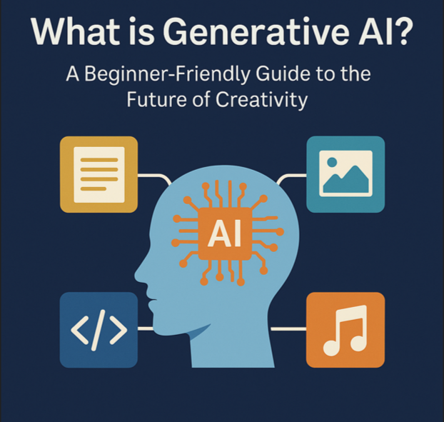

Generative AI: A Research Report
Asia parveen

##Explored & Expressed by: Asia Parveen

“Can a computer write a poem? Can it paint like an artist or compose music?”
Just a few years ago, the answer was no. But today, thanks to Generative AI, all of this — and much more — is possible.

Generative AI is changing the world around us. From helping writers generate content, to assisting designers, musicians, and developers, it is becoming one of the most powerful tools in technology.

In this article, we’ll explore what Generative AI is, how it works, what it can do, and why it matters — all explained in simple and clear language.

##What is Generative AI?

Generative AI is a type of artificial intelligence that can create new content — such as text, images, audio, video, or code by learning from existing data.

Instead of just understanding or analyzing information, it uses what it learns to generate something completely new, like a human creator would.

##How Does It Work?

Generative AI learns by studying huge amounts of data. For example, if you want it to write stories, you train it with thousands of books. If you want it to create art, you feed it thousands of images.

🟢Key Technologies Behind It:

🟢Neural Networks — Systems that work like a simplified human brain.

🟢Transformers — AI models that understand and generate language (used in ChatGPT).

🟢GANs — Two AI models working together to improve results (used in deepfakes),

🟢GANs — Two AI models working together to generate realistic content (used in AI-generated media like faces, voices, or videos)

🟢Diffusion Models — Used to create detailed, high-quality images (like in DALL·E or Midjourney).

🟢Large Language Models (LLMs): Trained on text data to understand and generate human-like responses.

##What Can Generative AI Do?

Generative AI can do a lot of creative and useful tasks:

🔹Text Creation:
Writes blogs, stories, emails, reports.

Tools: ChatGPT, Jasper

🔹Image Generation:
Turns ideas into artwork or designs

Tools: DALL·E, Midjourney

🔹Video and Animation:
Creates video clips or visual effects

Tools: Runway ML

🔹Music and Sound:
Composes music, adds background tracks, clones voices

Tools: Suno AI

🔹Code Writing:
Helps developers write, fix, or explain code

Tools: GitHub Copilot

#Real-World Applications:

Here are some tools that show what Generative AI can do:

ChatGPT — Chats and writes like a human

DALL·E — Turns text into images

DALL·E — Turns text into images

Jasper AI — Writes marketing content

Runway ML — Helps edit and generate video

Suno AI — Creates AI-powered music and voices

##Why is Generative AI Important?

Generative AI offers many benefits:

Saves time — Helps finish tasks faster

Boosts creativity — Inspires new ideas

Makes work easier — Handles repetitive tasks

Personalization: Tailors content to individual preferences.

Multidisciplinary Use: Applicable in education, business, design, healthcare, and more.

The Future Scope of Generative AI:

Generative AI is still growing. In the coming years, we may see:

Smarter virtual assistants that understand emotion and intent.

Personalized learning tools in schools.

AI helping artists, musicians, and writers.

AI collaboration with artists, musicians, and writers

Virtual reality experiences powered by AI-generated environments.

Ethical AI systems focused on fairness, transparency, and responsibility.

Ethical Considerations: Using Generative AI Responsibly:

With powerful technology comes serious responsibility. While Generative AI opens exciting possibilities, it also raises important ethical questions and challenges.

Final Thoughts: Embracing the Future of AI Creatively:

Generative AI is more than just a tool — it’s a revolutionary force reshaping how we create, communicate, and solve problems.

From students and developers to marketers, educators, and artists, this technology offers endless opportunities to enhance productivity, spark creativity, and explore new ideas.

The future of creativity is here. Now is the time to learn, experiment, and lead with Generative AI — ethically and intelligently.

📝Disclaimer: This article is for educational and informational purposes only. The content reflects the author’s understanding and interpretation of Generative AI at the time of writing. Readers are encouraged to explore additional sources and verify current developments, as AI technologies continue to evolve rapidly.

🖋️ Curated, Researched, and Written by Asia parveen

Student Leader in GIAIC Full Stack Developer | Frontend Developer React.js| Next.js | JavaScript |Python Developer | AI Developer|Generative AI Developer|MongoDB
